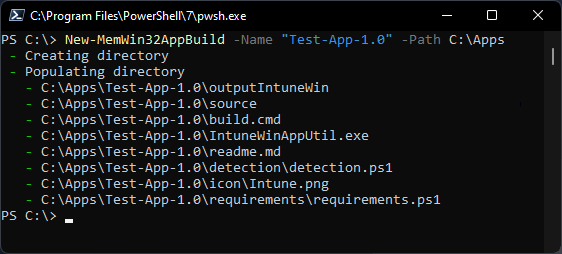
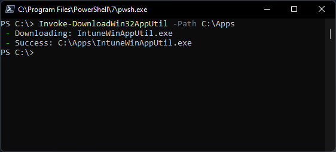

# MEM-Win32App-Builder


PowerShell module to create an organised directory structure for building Microsoft Endpoint Manager Win32 Apps.

## Overview

Creating win32 apps in Microsoft Endpoint Manager can become quite complex if the app you are installing has multiple install commands, or a custom detection/requirements script. And quite often you will have to document the the process and decisions made for use at a later date when updating the package. This module will enable you to create a directory structure to help when packaging the app, store information in the `readme.md` file, which can then be stored in source control.

Module version 0.1.3 contains IntuneWinAppUtil.exe version 6.2107.52.0

## Installation

PowerShell Gallery download/install

```powershell
Install-Module -Name "MEM-Win32App-Builder"
```

To update the module

```powershell
Update-Module -Name "MEM-Win32App-Builder"
```

## Usage

To create a an app packaging directory called `Test-App-1.0` in the `C:\Apps` directory, run the following:

```powershell
New-MemWin32AppBuild -Name "Test-App-1.0" -Path "C:\App"
```



You can then populate the directories with the following:

* __detection__ : This folder will contain your `detection.ps1` file if you determine the app requires one.
* __icon__ : The icon for the app. Delete the default `intune.png` file.
* __outputIntuneWin__ : This is where the your app's `intunewin` file will be output to.
* __requirements__ : This folder will contain your `requirements.ps1` file if you determine the app requires one.
* __source__ : This contains the `exe/msi` and any `cmd` scripts required to install

The following files in the root of the new app package directory are as follows:

* __build.cmd__ : Once all app files are in-place and you are ready to create the `intunewin` file, edit the `exe` name in `build.cmd` and run it.
* __IntuneWinAppUtil.exe__ : This is the Microsoft binary used to build the `intunewin` file.
* __readme.md__ : Can be used for documentation.

Once you all files in place you can run `build.cmd`. This will delete the `IntuneWinAppUtil.exe` as you would not want multiple copies of this in source control. But if you want to download it again you can use the following command.

```powershell
Invoke-DownloadWin32AppUtil -Path "C:\AppPackages"
```



## Example Scripts

Example install, detection and requirements scripts for Win32 apps TBC.
